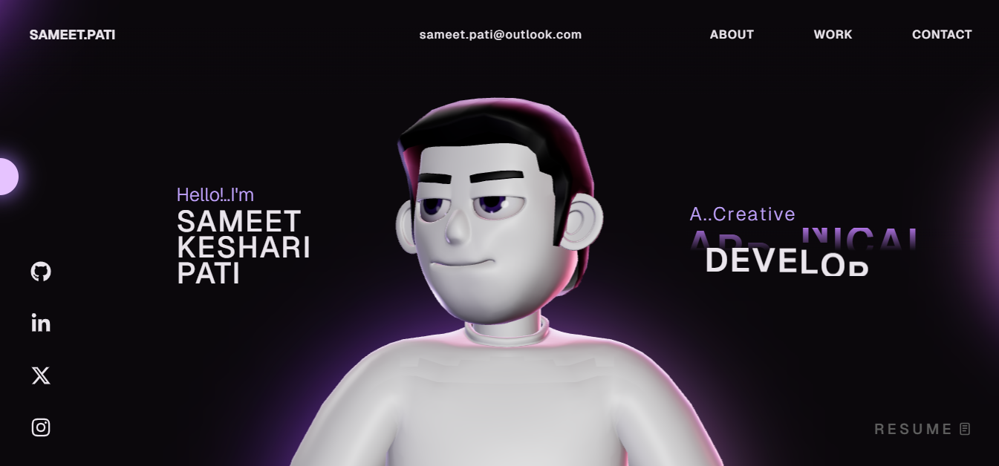
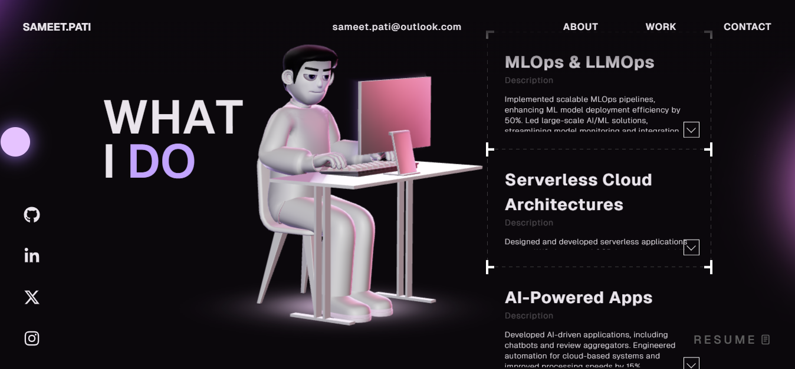

# 🌟 Sameet Pati Portfolio Website - Overview 🚀

Welcome to the **Sameet Pati Portfolio Website**, a cutting-edge showcase of innovation, creativity, and technical expertise. This website is a testament to the brilliance of **Sameet Pati**, the sole developer and mastermind behind this project. With a passion for technology and design, Sameet has crafted a seamless and visually stunning experience that reflects his journey as a developer, researcher, and innovator.

---

## 🌐 Live Website

The portfolio is live and accessible at: **[https://sameetpati.ct.ws/](https://sameetpati.ct.ws/)**

---

## 📸 Screenshots

Here are some screenshots showcasing the design and features of the website:

1. **Landing Page**  
   

2. **About Section**  
   

3. **Work Section**  
   

4. **Career Section**  
   

5. **Work Section**  
   
   
6. **TechStack Section**  
   

---

## 🛠️ Instructions

Follow these steps to run the project locally:

1. **Clone the Repository**  
   ```bash
   git clone https://github.com/SameetPati/3DAnimatedCharacterPortfolio.git
   cd 3DAnimatedCharacterPortfolio
   ```

2. **Install Dependencies**  
   Make sure you have [Node.js](https://nodejs.org/) installed. Then run:  
   ```bash
   yarn install
   ```

3. **Run the Development Server**  
   Start the development server to view the website locally:  
   ```bash
   yarn dev
   ```

4. **Build for Production**  
   To create a production build, run:  
   ```bash
   yarn build
   ```

5. **Preview the Production Build**  
   To preview the production build locally:  
   ```bash
   yarn preview
   ```

---

## 🛠️ Tech Stack

- **Frontend**: React, TypeScript, HTML, CSS, JavaScript  
- **Animation**: GSAP, Three.js, WebGL  
- **Build Tools**: Vite, Yarn  

---

## License

This project is open source and available under the [MIT License](LICENSE).

## Cred
 
To run the model use "OutScopeCharacter"
